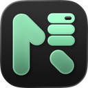

<div align="center">
  
  <h1>NodaDB Landing Page &amp; Product Workspace</h1>
  <p>
    <strong>Universal local-first database management workspace built in Rust.</strong>
  </p>
  <p>
    Powered by <a href="https://nodadb.com"><strong>Kulacore</strong></a> · Live at <a href="https://nodadb.com"><strong>nodadb.com</strong></a>
  </p>

  <p>
    <a href="https://github.com/ElvinEga/NodaDB/releases/tag/v0.3.10">
      
    </a>
    <a href="https://nodadb.com">
      
    </a>
    <a href="https://bun.sh">
      
    </a>
    <a href="https://nextjs.org">
      
    </a>
  </p>
</div>

---

## ⚡ About NodaDB

**NodaDB** is a modern, local-first database management platform for developers and data teams. Engineered in Rust and powered by **Kulacore**, NodaDB lets you connect to, explore, query, and visualize SQL and NoSQL databases in one fast, native application with zero cloud dependency.

### ✨ Key Features

- 🌐 **Universal Database Support**: Native drivers for PostgreSQL, MySQL, SQLite, MongoDB, Redis, ClickHouse, MariaDB, Neon, Supabase, PlanetScale, Cloudflare D1, DuckDB, and PgVector.
- 🔀 **Relationship Flow**: Multi-table record traversal and automatic foreign key link discovery without complex manual JOINs.
- ⌨️ **CommandPalette (`⌘K`) & Slash Commands**: Keyboard-driven control for `/connect`, `/explore`, `/schema`, `/flow`, `/explain`, `/export`, `/diff`, and `/tunnel`.
- 🔒 **Local-First Vault Security**: 100% local-first data processing. Connection strings and SSL keys are encrypted locally using hardware AES-256-GCM keychains. Zero telemetry.
- 📦 **Multi-Platform Installers**: Native desktop packages for macOS, Windows (`.exe`, `.msi`), and Linux (`.AppImage`, `.deb`, `.rpm`).
- ⚡ **JOS Scroll Animations**: Performant scroll-driven entry animations powered by `jos-animation`.

---

## 🚀 Tech Stack

- **Framework**: Next.js 16 (App Router + Turbopack)
- **Runtime & Package Manager**: Bun
- **Styling**: TailwindCSS v4 + Vanilla CSS Design System
- **Animation**: `jos-animation` (v0.9.2) + Framer Motion (`motion/react`)
- **Icons**: Lucide React + Custom Database & OS SVG Icons
- **Type Safety**: TypeScript 5.8

---

## 🛠️ Getting Started Locally

### Prerequisites

Ensure you have [Bun](https://bun.sh) installed.

```bash
bun --version
```

### Installation & Development

1. **Clone the repository**:
   ```bash
   git clone https://github.com/ElvinEga/NodaDB_Landing.git
   cd NodaDB_Landing
   ```

2. **Install dependencies**:
   ```bash
   bun install
   ```

3. **Start the development server**:
   ```bash
   bun run dev
   ```

4. **Open in browser**:
   Navigate to [http://localhost:3000](http://localhost:3000).

---

## 📜 Scripts

| Script | Command | Description |
| :--- | :--- | :--- |
| **Development** | `bun run dev` | Starts Next.js development server with Turbopack |
| **Production Build** | `bun run build` | Compiles optimized static production build |
| **Lint** | `bun run lint` | Runs ESLint checks across codebase |
| **Start** | `bun run start` | Runs Next.js production server |

---

## 📁 Project Structure

```text
noda/
├── app/
│   ├── download/         # Technical Download Page (/download) & Layout SEO
│   ├── privacy/          # Privacy Policy Page (/privacy) & Layout SEO
│   ├── terms/            # Terms of Service Page (/terms) & Layout SEO
│   ├── not-found.tsx     # Custom 404 Error Page (ERR_404)
│   ├── layout.tsx        # Root Layout & Metadata (nodadb.com by Kulacore)
│   └── page.tsx          # Main Landing Page
├── components/
│   ├── icons/            # Real Database & Operating System SVG Icons
│   ├── CtaBanner.tsx     # Footer CTA Banner with OS Downloads
│   ├── DownloadModal.tsx # Desktop & Package Manager Quick Download Modal
│   ├── Footer.tsx        # Footer Navigation Columns & Kulacore Attribution
│   ├── Hero.tsx          # Hero Banner with Version Pill & Command Copy
│   ├── JosInit.tsx       # JOS Scroll Animation Engine Initializer
│   └── Navbar.tsx        # Navigation Bar & GitHub Repo Link
├── lib/
│   ├── releases.ts       # Release History (v0.3.10 -> v0.3.1) & Asset Download Helpers
│   └── utils.ts          # Tailwind Class Merge Utility
└── public/               # Brand Assets, Logo, Favicons & Preview Images
```

---

## 🔗 Links & Resources

- **Official Website**: [nodadb.com](https://nodadb.com)
- **GitHub Repository**: [github.com/ElvinEga/NodaDB](https://github.com/ElvinEga/NodaDB)
- **Latest Release (v0.3.10)**: [GitHub Releases v0.3.10](https://github.com/ElvinEga/NodaDB/releases/tag/v0.3.10)
- **Download Page**: [nodadb.com/download](https://nodadb.com/download)
- **Terms of Service**: [nodadb.com/terms](https://nodadb.com/terms)
- **Privacy Policy**: [nodadb.com/privacy](https://nodadb.com/privacy)

---

## 📄 License & Attribution

NodaDB is developed and published by **Kulacore**.
Website hosted at **nodadb.com**.
